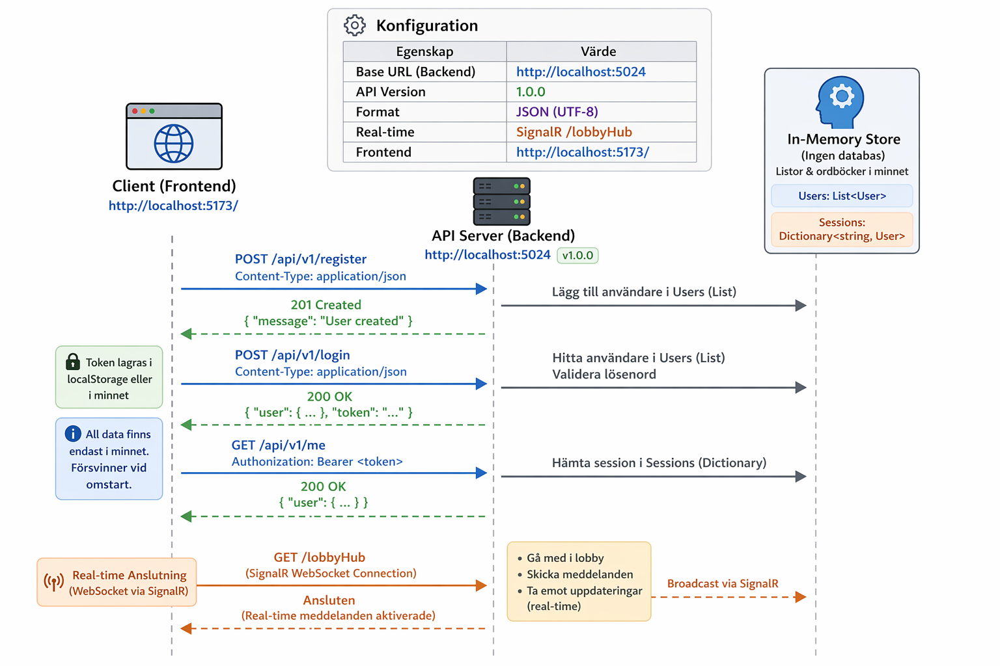

# 🎮 WordMaster API Contract
 WordMaster multiplayer word game.
Includes REST endpoints, SignalR real-time communication, and data models.
------------------------------------------------------------------------


## 📸 Overview Diagram



------------------------------------------------------------------------


## 📌 API Overview

| Property            | Value                       |
| ------------------- | --------------------------- |
| Base URLBAckend | `http://localhost:5024`     |
|  API Version**   | `1.0.0`                     |
| **Format**          | JSON (UTF-8)                |
| **Real-time**       | SignalR `/lobbyHub`         |
| frontend         | http://localhost:5173/

# 📡 Common Headers

| Header         | Value              | Description       |
| -------------- | ------------------ | ----------------- |
| `Content-Type` | `application/json` | Required for POST |
| `Accept`       | `application/json` | Preferred         |


------------------------------------------------------------------------
## ⚠️ Response Format

### Error

```json
{ "error": "Human readable message." }
```

### Status Codes

| Code | Meaning     |
| ---- | ----------- |
| 200  | OK          |
| 201  | Created     |
| 400  | Bad Request |
| 404  | Not Found   |
| 409  | Conflict    |


------------------------------------------------------------------------

# 🎭 Character Endpoints

## GET `http://localhost:5024/api/character/`

Returns all characters.

### ✅ Response

```json
[
    [
    {
        "id": "ugglan",
        "name": "Ugglan",
        "description": "The wise owl rewards long words.",
        "ability": {
            "type": 0,
            "bonusPoints": 3,
            "thresholdLength": 8,
            "thresholdSeconds": null,
            "effectDescription": "+3 bonus points for words longer than 8 letters"
        }
    },
    {
        "id": "leopard",
        "name": "Leopard",
        "description": "Lightning fast — rewards quick answers.",
        "ability": {
            "type": 1,
            "bonusPoints": 3,
            "thresholdLength": null,
            "thresholdSeconds": 10,
            "effectDescription": "+3 bonus points for words submitted within 10 seconds"
        }
    },
    {
        "id": "musen",
        "name": "Musen",
        "description": "Small but mighty — loves short words.",
        "ability": {
            "type": 2,
            "bonusPoints": 1,
            "thresholdLength": 4,
            "thresholdSeconds": null,
            "effectDescription": "+1 bonus point for words shorter than 4 letters"
        }
    },
    {
        "id": "björnen",
        "name": "Björnen",
        "description": "The bear shrugs off freeze attacks.",
        "ability": {
            "type": 3,
            "bonusPoints": 0,
            "thresholdLength": null,
            "thresholdSeconds": null,
            "effectDescription": "Immune to the Freeze chaos event"
        }
    }
]
]
---

## GET `http://localhost:5024/api/character/ugglan`

{
    "id": "ugglan",
    "name": "Ugglan",
    "description": "The wise owl rewards long words.",
    "ability": {
        "type": 0,
        "bonusPoints": 3,
        "thresholdLength": 8,
        "thresholdSeconds": null,
        "effectDescription": "+3 bonus points for words longer than 8 letters"
    }
}

| Param | Type   | Description  |
| ----- | ------ | ------------ |
| id    | string | Character ID |

---

## POST `http://localhost:5024/api/character/ability`

Calculate bonus points.

### 📥 Request

```json
{
  "characterId": "ugglan",
  "word": "katastrofal",
  "secondsTaken": 7.3
}
```

### 📤 Response

```json
{
  "bonusPoints": 3,
  "abilityTriggered": true
}
```

---

# 🏠 Lobby Endpoints

## POST `http://localhost:5024/api/lobby/`

Create a lobby.


{
    "lobbyId": "85E689",
    "inviteCode": "fe6ffc4c1dff"
}


-----------------------------------------------------------

## GET `http://localhost:5024/api/lobby/{{lobbyId}}/`
{
    "id": "85E689",
    "inviteCode": "fe6ffc4c1dff",
    "letters": [
        "N",
        "H",
        "Ö",
        "Z",
        "N",
        "N",
        "R",
        "X",
        "A",
        "K",
        "U",
        "Å",
        "A",
        "L",
        "H"
    ],
    "players": [
        {
            "id": "a4099d0c-bc36-4828-af5f-b617c619765f",
            "name": "Fatima",
            "isHost": false,
            "connectionId": "666cf63d-900f-4cdd-af14-463bb717924f",
            "score": 0,
            "isReady": true,
            "joinedAt": "2026-04-09T09:04:15.4831992Z"
        },
        {
            "id": "b9bb01ad-7db4-42fd-8db8-6e5f50486529",
            "name": "Oskar",
            "isHost": false,
            "connectionId": "cc99c74c-b4ba-4253-8adc-475afbe88196",
            "score": 0,
            "isReady": true,
            "joinedAt": "2026-04-09T09:04:15.5710071Z"
        }
    ]
}

## POST `http://localhost:5024/api/lobby/{id}/join`

Join a lobby.

{
  "name": "Fatima"
}

## POST `http://localhost:5024/api/lobby/{id}/ready/{playerId}`

Marks player as ready.
{
  "name": "Fatima"
}
---


# 🎮 Game Endpoint

## POST `http://localhost:5024/api/game/{lobbyId}/validate`

{
  "word": "KATT",
  "category": "Animal",
  "letters": ["K","A","T","T"]
}`

### 📤 Response

```json
{
  "isValid": true,
  "message": "Word found"
}
```

---

# 🧮 Score Calculation

## POST `http://localhost:5024/api/score/calculate`

### 📥 Request


### 📤 Response

```json
{
  "player1": 50,
  "player2": 30
}
```
------------------------------------------------------------------------

## 🧾 Rules

| Rule           | Points |
| -------------- | ------ |
| Unique word    | +10    |
| Shared word    | +5     |
| Long word      | +5     |
| All categories | +50    |

---

# ⚡ Real-time (SignalR)

## Hub URL

```
/lobbyHub
```

---

## Events

### PlayerJoined

```js
connection.on("PlayerJoined", (player) => {});
```

### PlayerReady

```js
connection.on("PlayerReady", (id) => {});
```

### GameStarted

```js
connection.on("GameStarted", (lobbyId) => {});
```

---

# 🔄 Core Flow

```
Create Lobby → Join → Ready → Start → Play → Score
```

------------------------------------------------------------------------

# 🔐 Notes

* No authentication required
* Max 2 players per lobby
* In-memory storage
* Requires CORS config

------------------------------------------------------------------------

# 🚀 Future Improvements

* Authentication (JWT)
* Persistent database
* Match history
* Rankings

------------------------------------------------------------------------